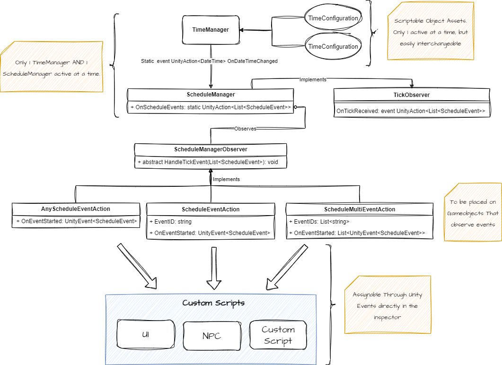
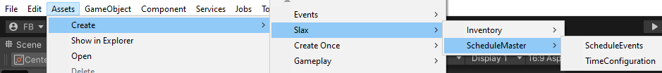
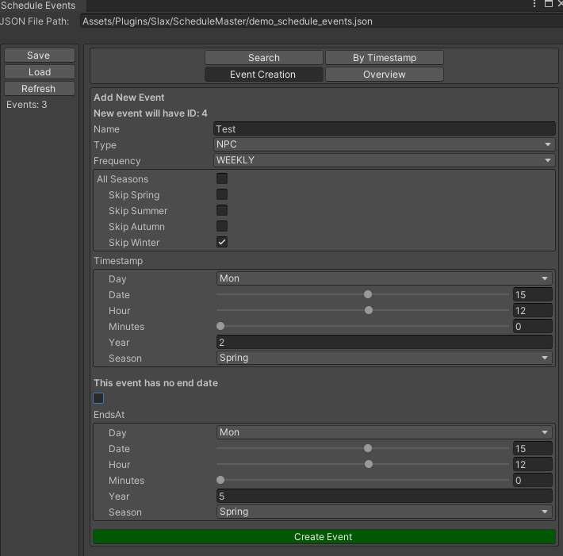

# Schedule Master

A robust Time & Schedule Event management system. Inspired from games like Harvest Moon / Stardew Valley, this package allows you to handle Tick events in your game as well as creating and managing scheduled events that can be then processed by NPCs, UI or Game managers to trigger any custom script you attach it to.

## Installation

1. In Unity, from the package manager, click the `+` icon
2. Select `Add package from git URL...`.
3. In the text box that appears, enter this projects git url `https://github.com/FelixBole/schedule-master.git`
4. That's it !

## Features

- A Time manager that raises Tick events based on your configuration
- A Schedule Event editor that lets you quickly browse, create and modify events
- A JSON event file to store you events, allowing you to edit outside of Unity with your own tools
- A Schedule manager that processes Tick events to look for events that should be triggered at the corresponding timestamp
- Event Observer base classes to attach to your GameObjects that raise UnityEvents when an event with the corresponding ID is received
- Basic UI classes to handle things such as time rendering and clocks
- Example prefabs (in Samples) for getting started

## Flow Overview



## Usage

### TimeManager

The TimeManager class is responsible for invoking Tick events with a custom DateTime object providing observers of these events with the information of the DateTime the Tick happened. There should only exist one per scene / game as it invokes a static event.

#### TimeConfigurationSO

The Time Manager runs using a TimeConfiguration Scriptable object. This allows for much more flexibility to manipulate configuration and enables to create multiple assets of different time configurations to easily test your different events without having to manually go in and change the TimeManager values all the time.

Creating a TimeConfiguration asset can be done through the Asset creation menu
```
Create > Slax > ScheduleMaster > TimeConfiguration
```


### ScheduleManager

The ScheduleManager class listens to the Ticks raised by the TimeManager and handles the search for corresponding events that should happen at the set DateTime. It then provides helper methods and raises a static event with the found Events if there are any. Any listeners can then process the events sent through the event.

#### Inheriting from ScheduleManager

The ScheduleManager class is prepared for inheritance. If needed, it is possible to derive from this class to create a custom ScheduleManager.

### ScheduleEventAction

Schedule event action classes - `ScheduleEventAction`, `ScheduleMultiEventAction`, `AnyScheduleEventAction` - all implement the ScheduleManagerObserver abstract class wich defines how to listen to the ScheduleManager. 

**>These classes are the APIs between the Schedule system and your custom scripts.**

 They raise UnityEvents for easy drag n' drop of your scripts to trigger the wanted action whenever a valid event is received.

An example of this can be found in the Samples Prefabs folder : NPC-EventObserver, it defines an ID and a demo event trigger response script that moves the gameobject when the event is received.

## Schedule Event Format

Schedule Events are defined as a scriptable object for easier data management. They are serialized into a JSON format. This JSON format is responsible for storing all of the events of your game. 

The ScheduleEventsSO loads from the JSON file in its OnEnable method and it is possible to add and save new events directly through the custom editor window or with external tools by modifying the JSON file.

## Schedule Event Custom Editor

This package ships a custom editor for browsing, editing, creating and information about the events of your ScheduleEvents JSON file.

#### Opening the Custom editor
First, ensure you have created a ScheduleEventsSO asset
```
Create > Slax > ScheduleMaster > ScheduleEvents
```
When creating this scriptable object asset, it will generate an initial JSON file for your schedule events at Assets/schedule_events.json.

Once the asset is created, navigate to it in your project window and in the inspector you will be prompted to open the editor.

#### Creating an event from the editor
The Schedule Event Custom Editor allows you to easily create new events.
When selecting the `Event Creation` tab, you'll end up on a view that allows for configuration of a new event that will be automatically be placed inside your JSON events file.

In the following example screenshot, the setup enables the creation of an event with the name `Test` which is targeted to be used by an NPC on a Weekly basis.

This event will start on Monday 15th of Spring on Year 2 at 12:00PM and happen every week until Monday 15th of Spring at 12:00PM of Year 5, with the particularity to skip every week in the season of Winter.

If we wanted for this event to happen indefinitely, we could simply toggle the `This event has no end date` checkbox to ignore the end date entirely.


#### Moving the JSON file

If you decide to manually move the JSON file, Unity will probably send an error as the ScheduleEvents asset will not be able to find the JSON file at the DefaultFilePath defined for it.

After moving the file, open the asset, adjust the filepath at the top of the editor window and then click "Load" on the left sidebar. This will then fix the issues.
